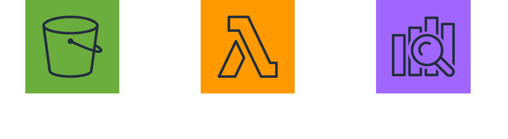
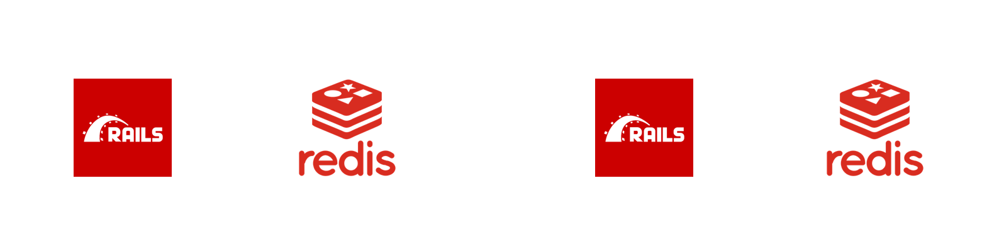
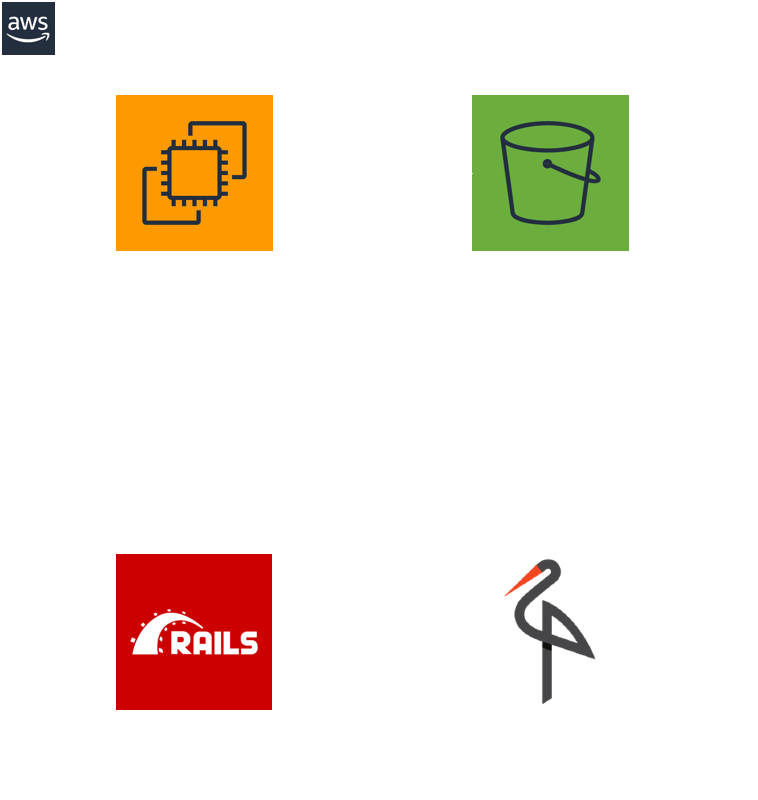
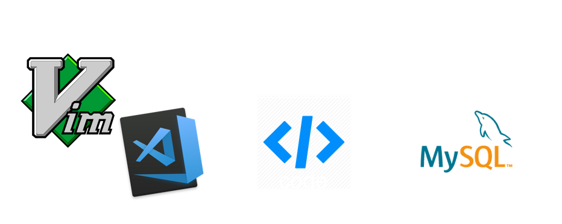
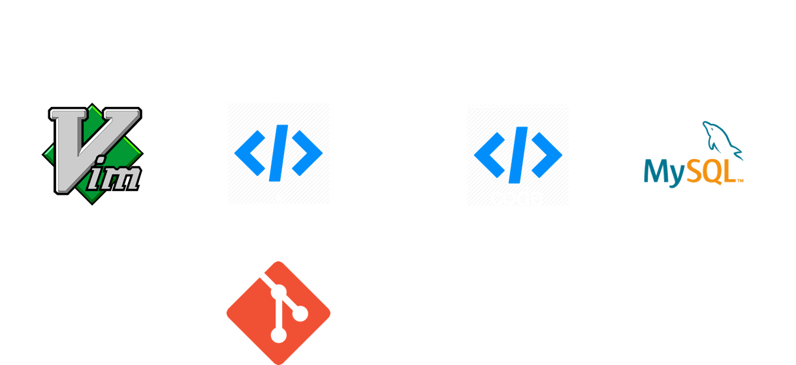
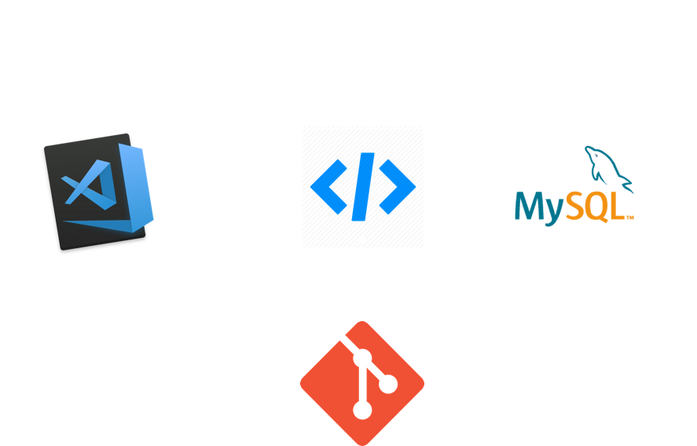
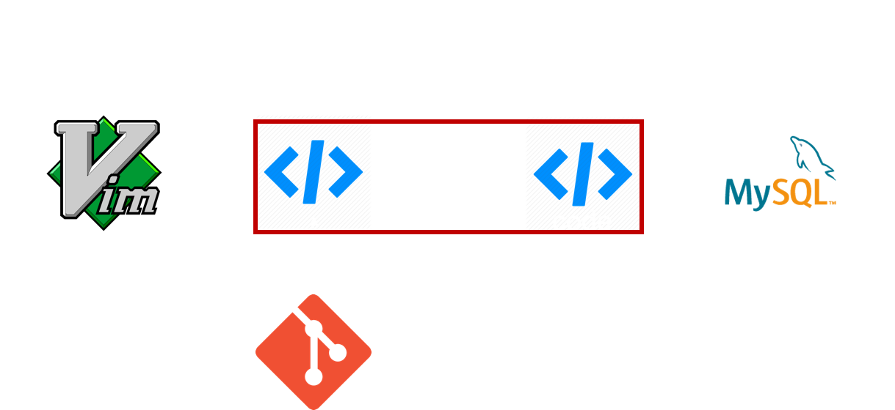

# 複雑なサービスの<br>開発環境

 メドピア株式会社

 侘美 怜

---

## 自己紹介
- 侘美 怜 (たくみ さとし)
  - Twitter: [reirei_As](https://twitter.com/reirei_As)
  - GitHub: [reireias](https://github.com/reireias)
  - Qiita: [reireias](https://qiita.com/reireias)

- 2019年2月にメドピアへ入社

- SRE 兼 サーバーサイドエンジニア

- 趣味は猫を愛でること


---

## 本日の話
### **開発者のローカルの開発環境について**

---

### サービスのアーキテクチャはどんどん複雑に

- サービスの成長

- PaaS/SaaSの活用
  - Elasticsearch、S3、Lambda

- 歴史的経緯による複雑化
  - 技術的負債

- マイクロサービス化等のアーキテクチャ変更

---

### メドピアも年々複雑なアーキテクチャに...

---

ここでやばいアーキテクチャを見せる

---

### サービスが成長する上で<br>複雑化しないことなんてほとんどない

---

#### **複雑化していく過程でローカルの開発環境も複雑に**

- つぎはぎのREADME.md

- 全体を知る人が少なくなる

- **そして、次第にメンテされなくなっていく...**

---

### 開発環境は大事

- 日々利用するので生産性に直結

- CIにも共通する


## **これまで培ってきた<br>ノウハウや課題を共有します**

---

## 3つの課題

1. PaaS/SaaSをどうする問題

2. コンテナとローカルの連携どうする問題

3. Docker for Mac遅い問題

---

<section data-background-color="#01579B">

## 1. PaaS/SaaSをどうする問題

- サービスのスピーディーな成長にはPaaS/SaaSの利用は不可欠

- 例: S3(ストレージ), Lambda(Function), Elasticsearch



**課題: これらを開発環境ではどうする？**


</section>

---

<section data-background-color="#01579B">

- #### 対策1: 同じものをローカルで動かす
  - ローカルでも動作可能なOSSの場合はこれ
  - 公式のコンテナイメージを利用するのが良さそう
    - docker-composeによるインストール手順のコード化が容易なため
  - 例：MySQL、Elasticsearch、Redis



</section>

---

<section data-background-color="#01579B">

- #### 対策2: 代替OSSをローカルで動かす
  - AWS固有のものとかは代替となるOSSがあったりする
  - 例：S3 -> minio、Lambda/SQS/SNS等 -> LocalStack
  - Mailはmailcatcherが最近は人気



</section>

---

<section data-background-color="#01579B">

- #### 対策3: 直接PaaS/SaaSに接続
  - 本番と同一のサービスを利用できるという点では良い
  - 開発者が多いと辛くなってくる
  - コストもかかる

　

- #### 対策4: 実装で切り替える
  - できる限り採用したくない
  - 例：本番やテスト環境ではS3に接続するが、ローカルではファイルシステムを使う
  - **ローカルやCIでは実施されないコードが出てくる**

</section>

---

<section data-background-color="#1A237E">

### 2. コンテナとローカルの連携どうする問題

- コンテナ内で動作させながら開発するケース
  - 依存が複雑で構築が手間
  - 開発環境の統一



- **課題：どうやって開発するか？**

</section>

---

<section data-background-color="#1A237E">

#### 対策1. Docker Volumeによる同期

- DockerのVolumeでローカルのコードをマウント
- 好きなエディタで編集
- **lintやテストのエディタ連携は少し工夫する必要あり**
  - 同一バージョンをローカルにも入れる
  - 実行パスを修正してコンテナ内のものを実行する



</section>

---

<section data-background-color="#1A237E">

#### 対策2. VS Code Remote Development機能を使う

- コンテナ内でVS Code Serverが起動する仕組み
- 既存のdocker-compose.ymlを流用して設定が可能
- まだ試せていないが、かなり良さそう
- **デメリット：私はVimmerである**



</section>

---

<section data-background-color="#004D40">

## 3. Docker for Mac遅い問題
**課題：Docker for Macとホスト間のファイル同期が遅い**



- コンテナ内にマウントしたローカルのファイルへのアクセス全般が遅い
- デバッグやテストのパフォーマンスが低下

</section>

---

<section data-background-color="#004D40">

#### 対策1. Docker Volumeのオプションを利用する

以下のオプションを利用する

- **consistent**
  - デフォルト
- **cached**
  - ホストからコンテナへの更新の遅延を許可する
  - コンテナ内のreadの高速化
- **delegated**
  - コンテナからホストのへの更新の遅延を許可する
  - コンテナ内のread/writeの高速化
  - 例：`yarn install` が 486s -> 49s まで高速化

https://docs.docker.com/docker-for-mac/osxfs-caching/

</section>

---

<section data-background-color="#004D40">

#### 対策1. Docker Volumeのオプションを利用する

使用例

```yaml
version: '3'
services:
  app:
    image: alpine:latest
    volumes:
      # <local path>:<container path>:<option> の形式で指定
      - /path/to/app:/app:delegated
```

</section>

---

<section data-background-color="#004D40">

#### 対策2. docker-syncによる同期の高速化

- `EugenMayer/docker-sync` を利用する

- `delegated` オプションよりも約2倍程度速い

- メドピアのとあるページでは
  - `delegated` オプション => 2.4秒

  - `docker-sync` => 1.0秒

</section>

---

<section data-background-color="#004D40">

docker-syncの仕組み


<br>

<a href="https://docker-sync.readthedocs.io/en/latest/advanced/sync-strategies.html" style="font-size: 24px;" target="_blank">
https://docker-sync.readthedocs.io/en/latest/advanced/sync-strategies.html
</a>

</section>

---

<section data-background-color="#004D40">

#### 対策3. 開発マシンをLinuxにする
- MacのDockerはネイティブでない(間にxhyve)

- プロダクトはAmazon LinuxやAlpineで動いている

- Linuxが最も開発機に適しているのは自明である

- ~~**まあ、現実的には情シスとか社内ルールによって無理だったり...**~~

</section>

---

# まとめ

- 開発環境は大事

- Linuxで開発したい

- Dockerを活用しよう
  - docker-composeによる構築の簡易化

  - CI環境へ流用しやすい

- Linuxで開発したい

---

## ご静聴ありがとうございました


