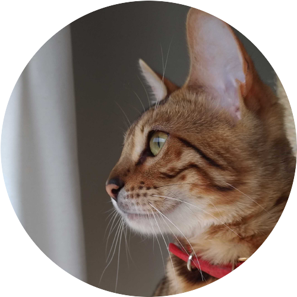
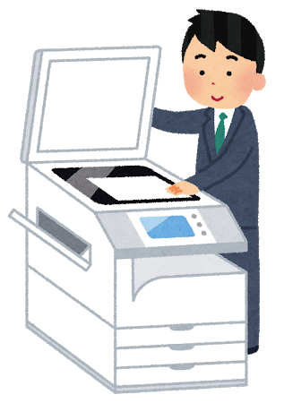

# 自己紹介

---

## 名前
侘美 怜(たくみ さとし)

M&P部エンジニア 兼 SRE

<figure style="display: inline-block;">
  
  <figcaption>社内用</figcaption>
</figure>
<figure style="display: inline-block;">
  
  <figcaption>インターネット用</figcaption>
</figure>

>>>

- 年齢: 30（社会人7年目）

- 出身: 岩手県

- 家族: 妻、猫

 

---

<section data-background="cat_bg.jpg">

# 趣味
- **猫を愛でること**

- 流行りの技術を試すこと

- 競技プログラミング、コードゴルフ（最近やってない）

- ハンドボール（引退した）

---

## 特技(?)

---

## 前職
富士ゼロックス株式会社 ソフトウェア開発本部

>>>

## 担当商品
- BtoB 翻訳サービス(1年)

- BtoB 中小向けクラウドストレージサービス(4年)

- BtoB 大企業向けクラウドストレージサービス(1年)

>>>

## 仕事(抜粋)
- 特許出願(5件くらい)

- AWS移行、設計、パフォーマンス改善

- Officeプラグイン開発

- マイクロサービス化設計、Swagger導入

- GoとかPythonとかでツールつくるおじさん

>>>

## 使った技術
**Java**, C#, python, golang, Node.js, **shell script**

PowerShell, **AWS**, RedHat, CentOS

Docker, PostgreSQL, SQL Server, jQuery, Vue.js

---

## 最近興味がある技術
- Firebase

- Nuxt.js + Vue.js

- Kubernetes

- Vim

 

---

# 技術で組織に貢献できるエンジニアになる

よろしくおねがいします！
