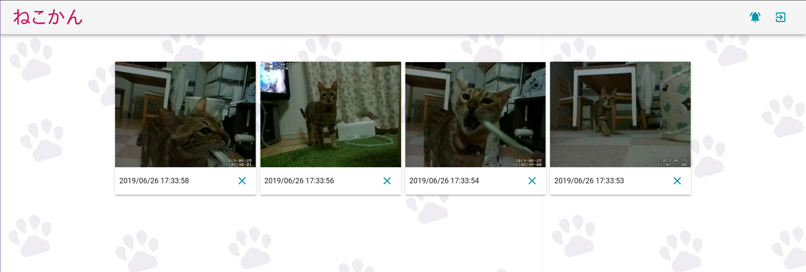
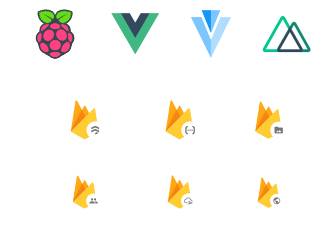
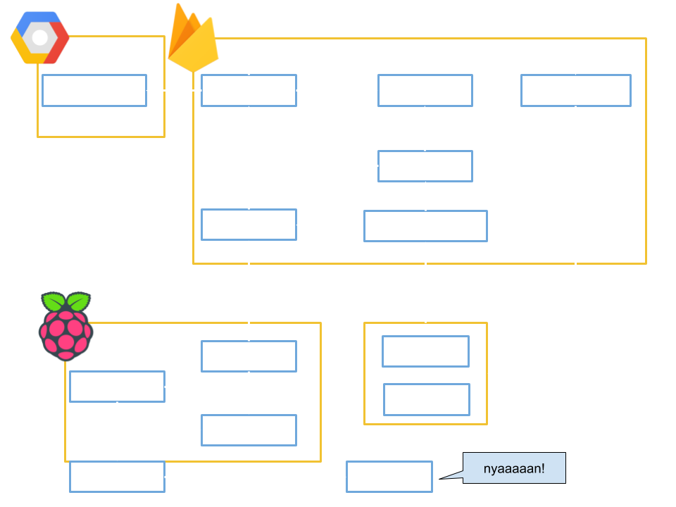

### Firebaseを活用したWebアプリケーション

### **猫監視システム**

---

## モチベーション

- FirebaseがWebアプリ用のインフラとしてどの程度使えるか知りたかった

- 不在中の猫が家で何しているのか気になる

---

## できたもの

[https://cat-watcher.firebaseapp.com/](https://cat-watcher.firebaseapp.com/)

>>>

## ソースコード

[reireias/cat-watcher](https://github.com/reireias/cat-watcher)

[reireias/raspberrypi-ansible](https://github.com/reireias/raspberrypi-ansible)

---

## 採用技術

>>>

## RaspberryPi Zero

- 512MB RAM, 802.11b/g/n

- カメラモジュール

- モバイルバッテリーからの供給での稼働を想定

>>>

## Vue.js + Vuetify.js + Nuxt.js

- (個人的に)鉄板の組み合わせ

- Vuetify.jsのUIコンポーネント

- Nuxt.jsによるSPA、PWA

- Nuxt.jsが内包するVuexによるFluxでのデータ管理

>>>

## Firebase

**mBaaS(modile Backend as a Service)**

- Authentication: 認証

- Hosting: 静的サイトホスティング

- Firestore: リアルタイムNoSQL

- Storage: データ保存ストレージ

- Functions: イベント駆動形FaaS

- Messaging: Push通知

---

## システム構成

---

## Firebaseに対する考察

>>>

### Webアプリエンジニア (サーバーサイド/フロントエンド)として

- 認証連携周りがかなり楽。革命レベル。

- デプロイが簡単

- Storage/Firestoreのアクセス権が簡単に定義できる

- FunctionsをWebエンジニアだけで簡単に実装/デプロイ

- Push通知機能がある

- **NoSQL**の設計と、Functionsによる**イベント駆動**のサーバーサイド設計の難易度が高い
  - 全てNoSQLのFirestoreで実現できるわけではない

>>>

## SREとして

- 圧倒的にフルマネージド = **管理コスト低**
  - 証明書管理不要
  - スケーリング(Functions/Firestore/Hosting)
  - もろもろのサーバーの管理コスト無し

- GCPとの統合が容易
  - 足りない機能はGCPでまかなうことができる
  - 親和性というのは大事、親和性が低いと権限管理がうまくいかない

---

## Firebaseの個々の機能に関して

>>>

## Authentication

- **firebase-ui**を使うと超低コストで3rdPatyログインのボタン+機能が実現可能
  - ただし、リダイレクト時のこまかい挙動に関して手を入れれないのは微妙

- BtoB向けのような、ユーザー管理者によるユーザー管理機能の提供は難易度高そう

- 運用者によるユーザー管理画面はAdmin SDK + Serverでいけそう

>>>

## Hosting

- CDN、証明書、HTTP2対応等が簡単に実現できる

- 静的サイトがメイン(or Mobileアプリ)の場合はこれで十分

>>>

## Storage

- 複雑なアクセス権制御さえなければ十分

- 裏はGoogle Cloud Storageなので、S3と同等と思ってよいです

>>>

## Firestore

- **Firebaseを使いこなせるかは、Firestoreを使いこなせるかにかかっていると言っても過言ではない**

- リアルタイムNoSQL(マジでクライアントにリアルタイムに変更が伝わるので、UXが良い)

- NoSQLの一般的な特徴になるが、複雑なジョイン、複雑な検索、複雑なリレーショナルは苦手

- それと引き換えにパフォーマンスとスケーラビリティが高い

- これらの特性から従来のRDBMSとは異なる設計を求められる点が難しい

>>>

## Messaging

- Push通知がまあまあ簡単にできる

- 認証キーとかトークンの関係で、意外とサーバーサイド(Functions)上でしかできない(クライアント側でやると面倒な)ことがあったりする

- トピックの購読による配信は複数のトピックを組み合わせられるので、これで基本はいろんな配信パターンを実現できるはず

---

## 結論

- Firebaseの機能で満たせる要件の場合、**圧倒的に開発コストを抑えることが可能**
  - NoSQLで足りるか？
  - Functionsの制約下でバックエンドは十分か？

- 上記の見極めは難しい
  - 開発初期に見通せるか？
  - 最初からRailsありきと、(Firebaseで作って)途中でRails等を足すのとどちらがコストが低いか

---

## その他感想1

- やはりベースはmBaaSであり、**モバイルでしか利用できない**機能のほうが多い

- FirebaseのAPIリファレンスサイトがちょっと重い

- functionsの名前をイベント名ベースにするのか、処理内容にするのか悩む

- PWAのservice workerのデバッグめっちゃ辛い

>>>

## その他感想2

- [ここ](https://14code.com/blog/20170226_1241/)参考になった

- push通知をクリックした際、PWAで開くのか、ブラウザで開くのかはユーザーの設定次第

- firebase-uiは簡単にログインボタンを出せるが、リダイレクト時のロードをアニメで制御するのが難しい

- iOSのPWAでのリダイレクトを伴うGoogle認証が、最新のOSでないと成功しない(**iOSのPWA対応が遅い**)

>>>

## その他感想3

- ステージング環境が勝手に作成される(まだ試せていない)

- USB-OTGむずい
