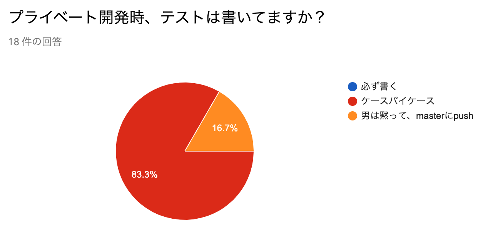

## CIサービス選定日記

#### [GitHub Actions](https://github.com/features/actions) vs [Travis CI](https://travis-ci.org/) vs [CircleCI](https://circleci.com/)


---

## 自己紹介


<br>

- たくみ さとし

- MENSAエンジニア

- サーバーサイドエンジニア 兼 SRE？

- 最近はモンスターをハンティングしてると、飼い猫にハンティングされる日々を過ごしています

---

## 今日のお話

プライベート開発時のSaaS型 CIツールを選定しなおしてみた

---

## 見直した背景

---

### 荒ぶるDependabot


---

### CIツールは群雄割拠の時代!!

[CNCF Cloud Native Interactive Landscape](https://landscape.cncf.io/category=continuous-integration-delivery&format=card-mode&grouping=category)

---

### GitHub Actionsという超新星の登場


---

ということで、自分のCIツール選定を見直してみたお話

---

### 閑話休題：みんなCI何使ってるの？

- 会社としてのCIツール選定の記事は星の数ほどある

- 個人開発は少ない、私気になります

- いい機会だったのでアンケートをとってみました

**ご協力ありがとうございました**

---


---



---


---


---

## 選定のための前提条件

- よく書く言語：Node.js、Python、Golang、Shell Script...

- よく作るもの：Webアプリ(on GitHub Pages or Firebase)、CLIツール、ライブラリ

- 通知はSlackのあるチャンネルに一元化

---

### CIツールに求めるもの
- 無料、もしくは(かぎりなく)安いこと

- **簡単に**設定ファイルが記述できる

- **簡単に**Slack通知が設定できる

- **簡単に**GitHub Pagesへのデプロイができる

- **簡単に**秘密情報を設定できる

- (できれば)任意のDockerイメージを使える

---

### 逆に不要なもの

- 並列数

- ワークフロー機能

- 複数リポジトリを扱う機能

- 実行環境の細部まで設定可能であること

- マトリックスビルド

- AWSやGCP等のPaaSへのデプロイ機能

---

### とりあえず試す

<a href="https://github.com/reireias/compare-ci-tools"></a>

- シンプルなnodeのプロジェクト
- CIで実行するのは `yarn test` と `yarn lint`
- 結果をSlackに通知する

---

### GitHub Actions

```yaml
---
name: main
on: [push, pull_request]
jobs:
  test:
    name: test
    runs-on: ubuntu-latest
    steps:
      - uses: actions/checkout@master
      - name: Setup node
        uses: actions/setup-node@v1
        with:
          node-version: '12.10'
      - run: yarn install
      - run: yarn lint
      - run: yarn test
      - uses: 8398a7/action-slack@v2.3.0
        with:
          status: ${{ job.status }}
          author_name: Actions
        env:
          GITHUB_TOKEN: ${{ secrets.GITHUB_TOKEN }}
          # Slackのwebhook urlはsettigsから登録
          SLACK_WEBHOOK_URL: ${{ secrets.SLACK_WEBHOOK_URL }}
        if: always()
```

---

### TravisCI

```yaml
---
language: node_js
node_js:
  - node
cache: yarn
script:
  - yarn lint
  - yarn test
notifications:
  email: false
  slack:
    # SlackにTravisCIのAppを追加し、Tokenを取得(使いまわし可能)
    # TravisのCLIを使い、暗号化したTokenを設定(リポジトリごとに変わる)
    secure: xxxxxxxxxxxxxxxxxxxxxxxxxxxxxxxxxxxxxxxxxxxxxxxxxxxxxxxxxxx
```

---

### CircleCI

```yaml
---
orbs:
  slack: circleci/slack@3.3.0
version: 2.1
jobs:
  build:
    docker:
      - image: circleci/node:12.10
    working_directory: ~/repo
    steps:
      - checkout
      - restore_cache:
          keys:
            - v1-dependencies-{{ checksum "package.json" }}
            - v1-dependencies-
      - run: yarn install
      - save_cache:
          paths:
            - node_modules
          key: v1-dependencies-{{ checksum "package.json" }}
      - run: yarn lint
      - run: yarn test
      # SLACK_WEBHOOKという環境変数をUIから設定しておく
      - slack/status
```

---

### 有意差なし
下記2点に関しては有意差はなさそう

- 無料、もしくは(かぎりなく)安いこと

- (できれば)任意のDockerイメージを使える

---

### 簡単に設定ファイルが記述できる

|                |      |
|:--------------:|:----:|
| GitHub Actions | 24行 |
|    Travis CI   | 12行 |
|    CircleCI    | 23行 |
|                |      |

- シンプルさだとTravisCIが強い

---

### 簡単にSlack通知が設定できる

- CircleCIやGitHub Actionsはorbsやactionsを利用するので記述が増える

- TravisCIは組み込みで機能がある


---

### 簡単に秘密情報を設定できる
- CircleCIとGitHub Actionsは**Web UIから**環境変数を登録

- API経由での指定は調べたけどできなさそう

- TravisCIは[travis-ci/travis.rb](https://github.com/travis-ci/travis.rb)というCLIツールで暗号化して**設定ファイルに**書き込む仕組み

- 若干だがTravis CIが優位(個人の感覚)

---

### 簡単にGitHub Pagesへのデプロイができる

**すべてを試せていません**

- GitHub ActionsはMarketplaceにいくつかActionsがある模様

- CircleCIは対応したOrbsがいくつかある模様

- Travis CIでは`deploy`というセクションで書ける
```yaml
deploy:
  provider: pages
  skip_cleanup: true
  github_token: $GITHUB_TOKEN
  local_dir: dist
  on:
    branch: master
```

---

## 総評

- Travis CIはかなりいろいろ隠蔽されていて、簡単に書ける

- GitHub Actionsはユーザーが増えたらActionsの開発が盛んになり、強そう

- CircleCIのOrbsも同様

- とはいえ、良さげなActions、Orbsの選定はだるい

---

### まとめ

- しばらくは~~楽したいので~~様子見で**Travis CI**の使用を継続！

- GitHub Actionsの成長が楽しみ！

---

## 参考文献
- [CIマニアから見た各種CIツールの使い所](https://sue445.hatenablog.com/entry/2018/12/07/114638)
- [CNCF Cloud Native Interactive Landscape](https://landscape.cncf.io/category=continuous-integration-delivery&format=card-mode&grouping=category)
