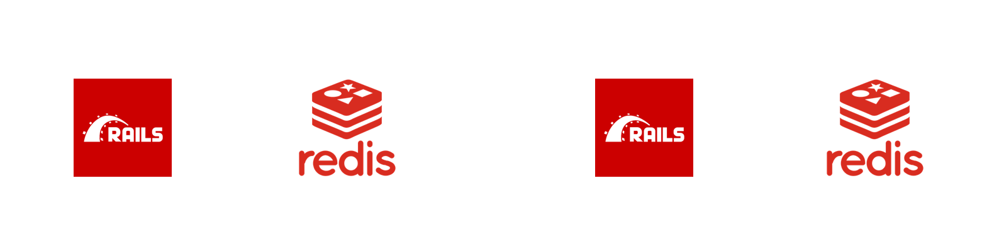
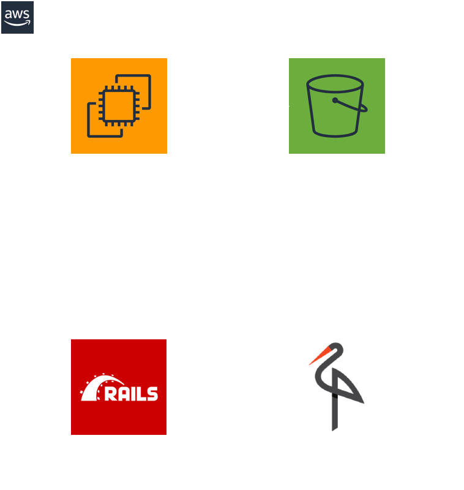
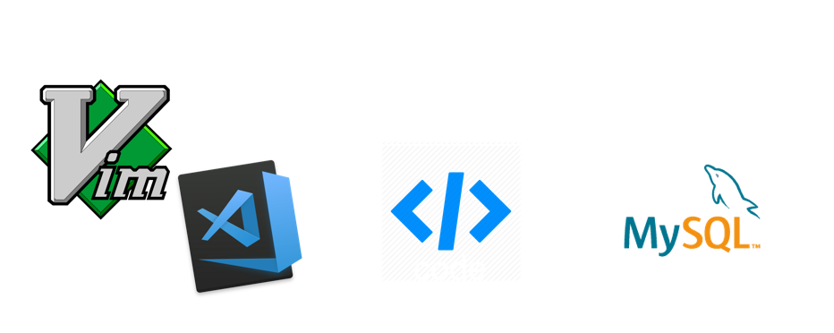
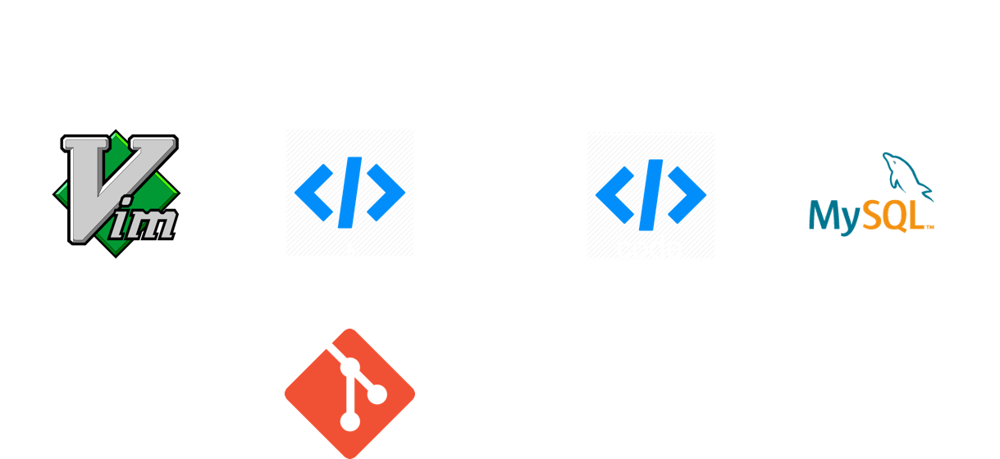
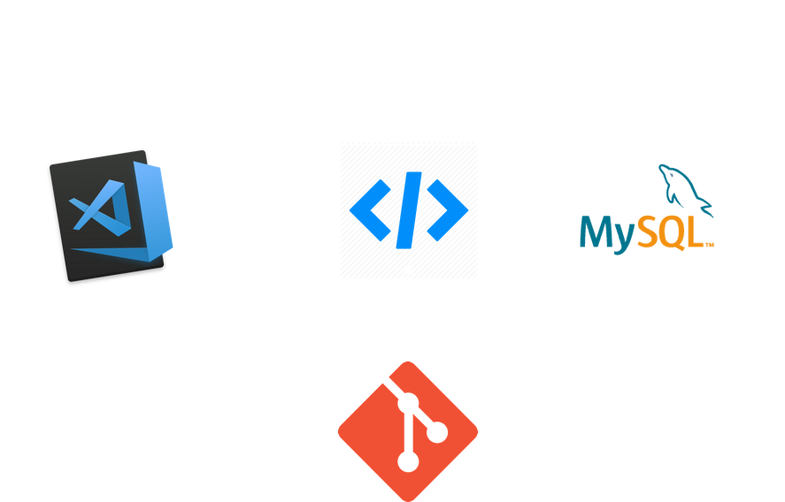
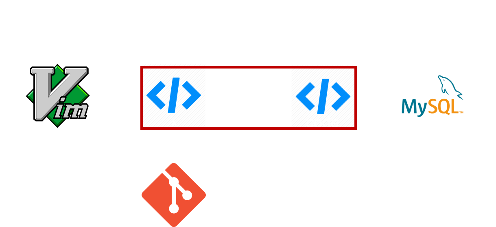

# 複雑なサービスの<br>開発環境

 メドピア株式会社

 侘美 怜

---

## 自己紹介
- 侘美 怜 (たくみ さとし)
  - Twitter: [reirei_As](https://twitter.com/reirei_As)
  - GitHub: [reireias](https://github.com/reireias)
  - Qiita: [reireias](https://qiita.com/reireias)

- 2019年2月にメドピアへ入社

- SRE 兼 サーバーサイドエンジニア

- 趣味は猫を愛でること


---

## 本日の話
### **ローカルの開発環境について**

---

### サービスが成長する過程でアーキテクチャはどんどん複雑になっていく

- PaaS/SaaSの活用
  - 例：Elasticsearch、S3、Lambda

- 歴史的経緯による複雑化
  - 技術的負債

- マイクロサービス化等のアーキテクチャ変更

---

### メドピアも年々複雑なアーキテクチャに...

ここでやばいアーキテクチャを見せる

---

#### **複雑化していく過程でローカルの開発環境も複雑に**

- README.mdがツギハギだらけに

- 全体を知る人が少なくなる

- **そして、次第にメンテされなくなっていく...**

- **開発効率が下がっていく...**

- という光景を幾度となく目にしてきた

---

### 開発環境は大事

- 日々利用するので生産性に直結

- CIにも共通する

---

## これまで培ってきた<br>ノウハウや課題を共有します

---

## 3つの課題

1. PaaS/SaaSをどうする問題

2. コンテナとローカルの連携どうする問題

3. Docker for Mac遅い問題

---

<section data-background-color="#01579B">

## 1. PaaS/SaaSをどうする問題

- スピーディーな開発にはPaaS/SaaSの利用は不可欠

- 例: S3、Lambda、Elasticsearch


**課題: これらを開発環境ではどうする？**


</section>

---

<section data-background-color="#01579B">

- #### 対策1: 同じものをローカルで動かす
  - ローカルでも動作可能なOSSの場合はこれ
    - 例：MySQL、Elasticsearch、Redis
  - 公式のコンテナイメージを利用するのが良い



</section>

---

<section data-background-color="#01579B">

- #### 対策2: 代替OSSをローカルで動かす
  - AWS固有のものとかは代替となるOSSがあったりする
  - 例：S3 -> minio、Lambda/SQS/SNS等 -> LocalStack
  - Mailはmailcatcherが最近は人気



</section>

---

<section data-background-color="#01579B">

- #### 対策3: 直接PaaS/SaaSに接続
  - 本番と同一のサービスを利用できるという点では良い
  - **開発者が多いと辛くなってくる**
  - **コストもかかる**

　

- #### 対策4: 実装で切り替える
  - できる限り採用したくない
  - 例：本番やテスト環境ではS3に接続するが、ローカルではファイルシステムを使う
  - **ローカルやCIでは実施されないコードが出てくる**

</section>

---

<section data-background-color="#1A237E">

### 2. コンテナとローカルの連携どうする問題

- コンテナ内で動作させながら開発するケース
  - 依存が複雑で構築が手間
  - 開発環境の統一



- **課題：どうやってコーディングするか？**

</section>

---

<section data-background-color="#1A237E">

#### 対策1. Docker Volumeを使う

- DockerのVolumeでローカルのコードをマウント
- 好きなエディタで編集
- **lintやテストのエディタ連携は少し工夫する必要あり**
  - 同一バージョンをローカルにも入れる
  - 実行パスを修正してコンテナ内のものを実行する



</section>

---

<section data-background-color="#1A237E">

#### 対策2. VS Code Remote Development機能を使う

- コンテナ内でVS Code Serverが起動する仕組み
- 既存のdocker-compose.ymlを流用して設定が可能
- まだ試せていないが、かなり良さそう



</section>

---

<section data-background-color="#1A237E">

#### 対策2. VS Code Remote Development機能を使う

- **デメリット：私はVimmerである**


</section>

---

<section data-background-color="#004D40">

## 3. Docker for Mac遅い問題
**課題：Docker for Macとホスト間のファイル同期が遅い**



- 理由：MacのDockerはネイティブでない(間にxhyve)
- マウントなので、ファイルへのアクセス全般が遅い
- デバッグやテストのパフォーマンスが低下

</section>

---

<section data-background-color="#004D40">

#### 対策1. Docker Volumeのオプションを利用する

以下のオプションを利用する

- **consistent**
  - デフォルト
- **cached**
  - ホストからコンテナへの更新の遅延を許可する
  - コンテナ内のreadの高速化
- **delegated**
  - コンテナからホストへの更新の遅延を許可する
  - コンテナ内のread/writeの高速化
  - 例：`yarn install` が 486s -> 49s まで高速化

https://docs.docker.com/docker-for-mac/osxfs-caching/

</section>

---

<section data-background-color="#004D40">

#### 対策1. Docker Volumeのオプションを利用する

`docker-compose.yml`での設定例

```yaml
version: '3'
services:
  app:
    image: alpine:latest
    volumes:
      # <local path>:<container path>:<option> の形式で指定
      - /path/to/app:/app:delegated
```

</section>

---

<section data-background-color="#004D40">

#### 対策2. docker-syncによる同期の高速化

- [docker-sync](http://docker-sync.io/) を利用する

- `delegated` オプションよりも約2倍程度速い

- 例：メドピアのとあるページの表示速度
  - `delegated` オプション => 2.4秒

  - `docker-sync` => 1.0秒

</section>

---

<section data-background-color="#004D40">

#### 対策2. docker-syncによる同期の高速化

<div style="float: left; width: 50%;">

before

```yaml
# docker-compose.yml
services:
  app:
    volumes:
      - /path/to/app:/app
```

</div>

<div style="float: right; width: 50%;">

after

```yaml
# docker-compose.yml
services:
  app:
    volumes:
      - sync-volume:/app

volumes:
  sync-volume:
    external: true
```

```yaml
# docker-sync.yml
version: '2'
syncs:
  sync-volume:
    src: '/path/to/app'
```

</div>

</section>

---

<section data-background-color="#004D40">

#### 参考：docker-syncの仕組み


<br>

<a href="https://docker-sync.readthedocs.io/en/latest/advanced/sync-strategies.html" style="font-size: 24px;" target="_blank">
https://docker-sync.readthedocs.io/en/latest/advanced/sync-strategies.html
</a>

</section>

---

<section data-background-color="#004D40">

## 対策3. 開発マシンをLinuxにする

- プロダクトはAmazon LinuxやAlpineで動いている

- プロダクトへのコンテナの導入も活発になってきている

- ### Linuxが最も開発機に適しているのは自明である！


**~~まあ、現実的には情シスとか社内ルールによって無理だったり...~~**

</section>

---

# まとめ

- 開発環境は大事、メンテしよう

- Linuxで開発したい

- Dockerを上手く活用しよう
  - docker-composeによる構築の簡易化

  - CI環境への流用/共通化が簡単

- Linuxで開発したい

---

## ご清聴ありがとうございました


