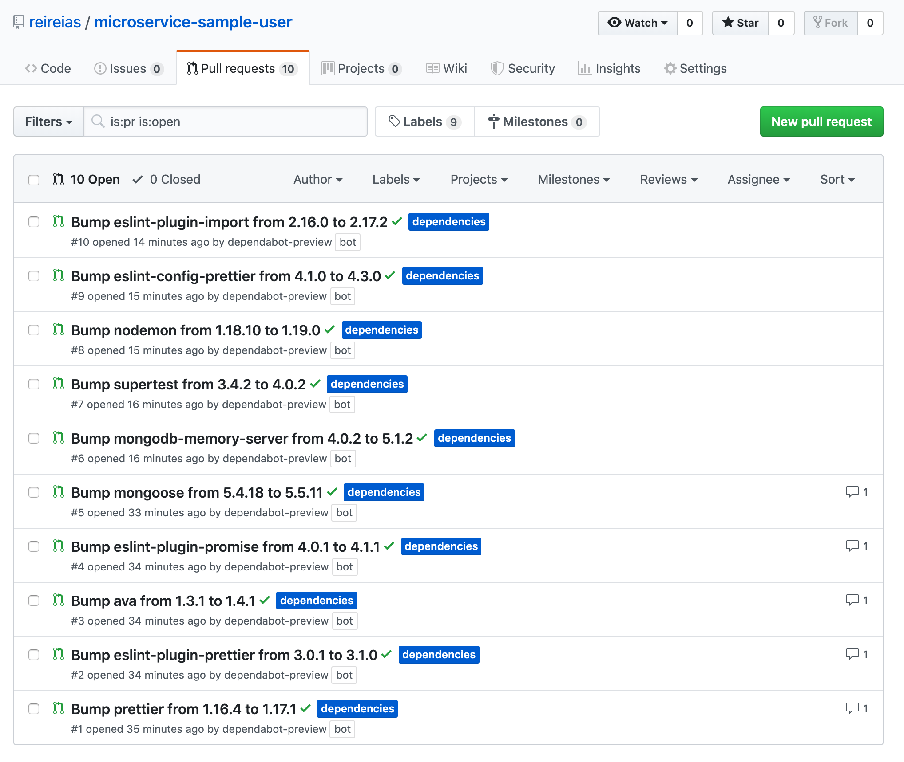
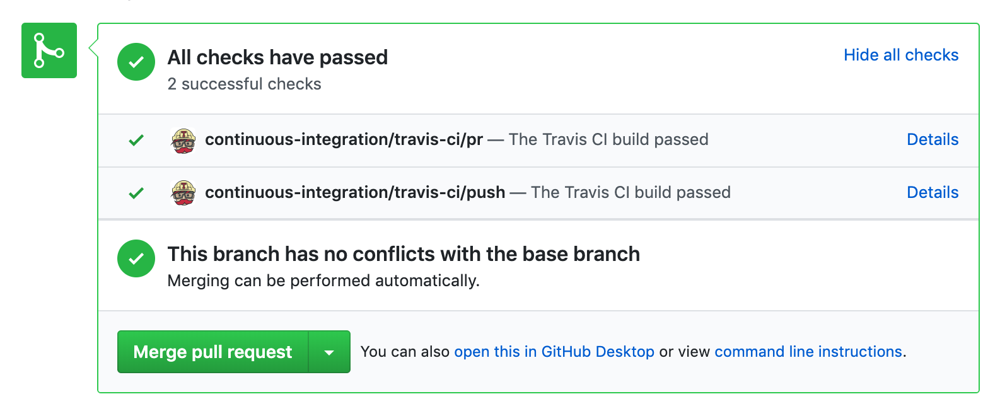

# Dependabotを導入してみた

---

## きっかけ

---

## Dependabot

---

## Dependabotとは?

- 「Dependabot」は、開発しているプログラムで使用している**ライブラリの更新を自動で**行ってくれるツールです

- GitHubで管理しているプログラムで使用しているライブラリのバージョンが古くなると、自動でその**ライブラリを更新するプルリクエストを作成**してくれる

---

## 自分のリポジトリに入れてみた

`reireias/microservice-sample-user`

(ついでにTravisCIの設定した)

---

## 設定

- DependabotにGitHubアカウントでサインイン

- 自分のリポジトリ一覧から有効にするリポジトリを選択

- 言語判定、パッケージ管理ツール判定は自動でやってくれる

---

## まつこと数分

---

## PRが来た！

---

## 中身

---

## CIもOK

---

## Compatibility

---

## 算出方法

- Dependabotは様々なリポジトリでそのモジュールをアップデートしてる

- その際のテスト結果を取得

- CIの通過率で算出する

---

## これが集合知か！
