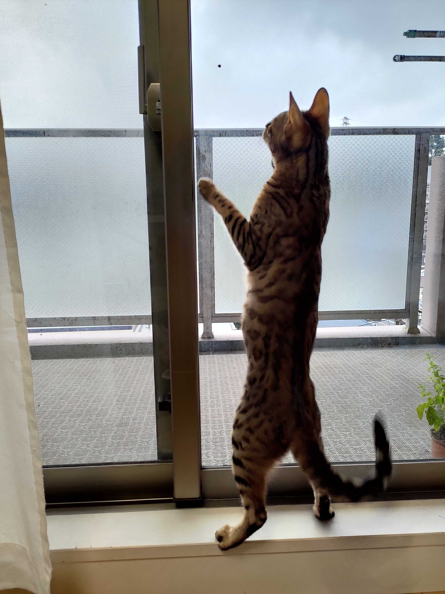
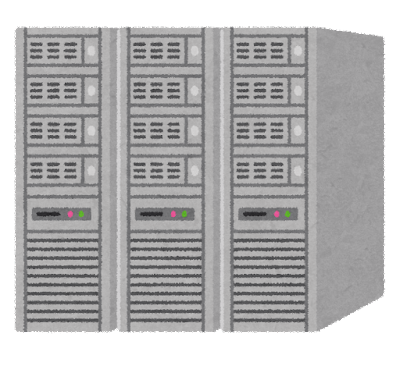
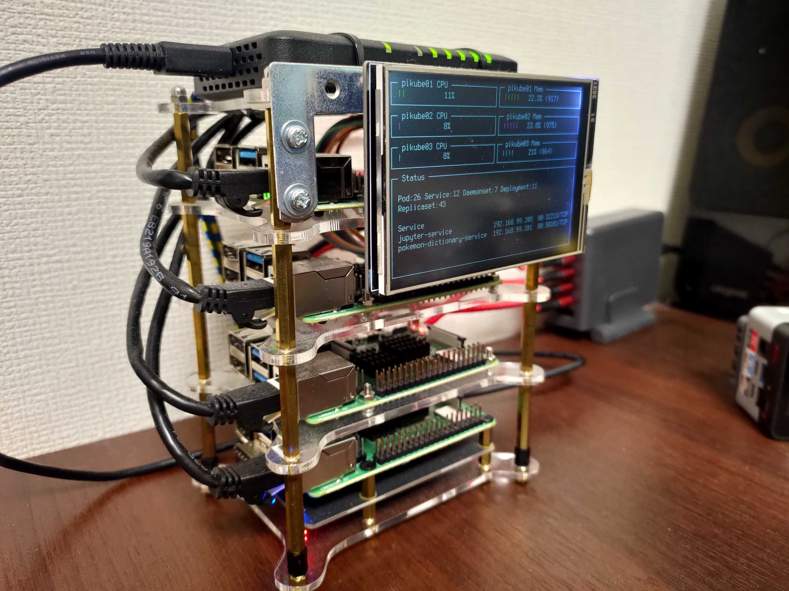
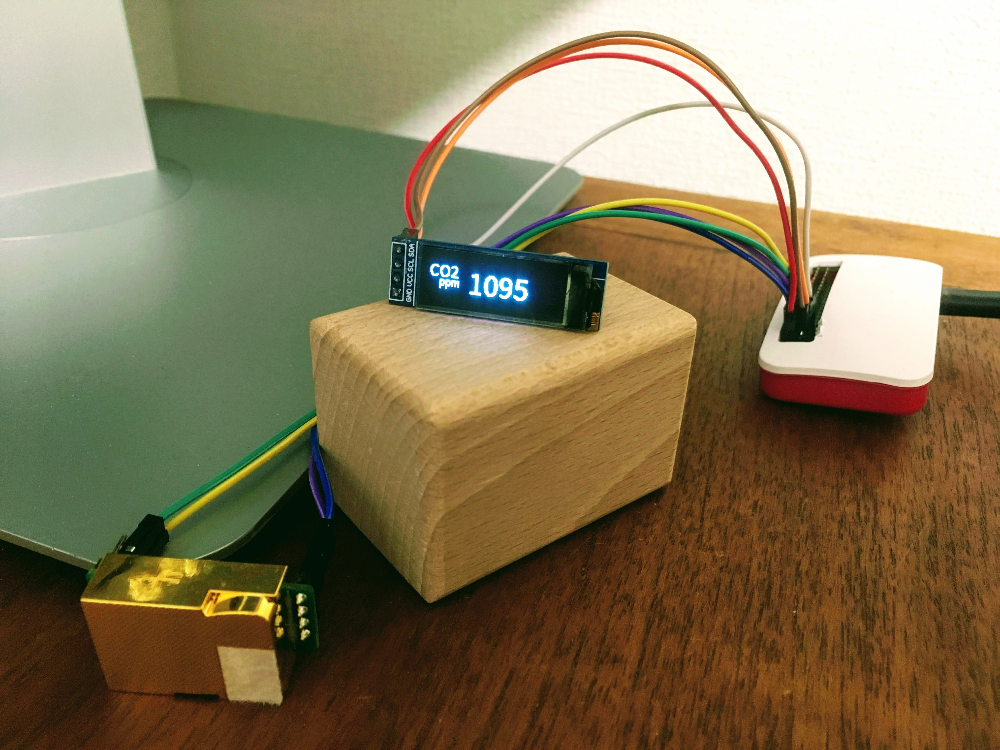
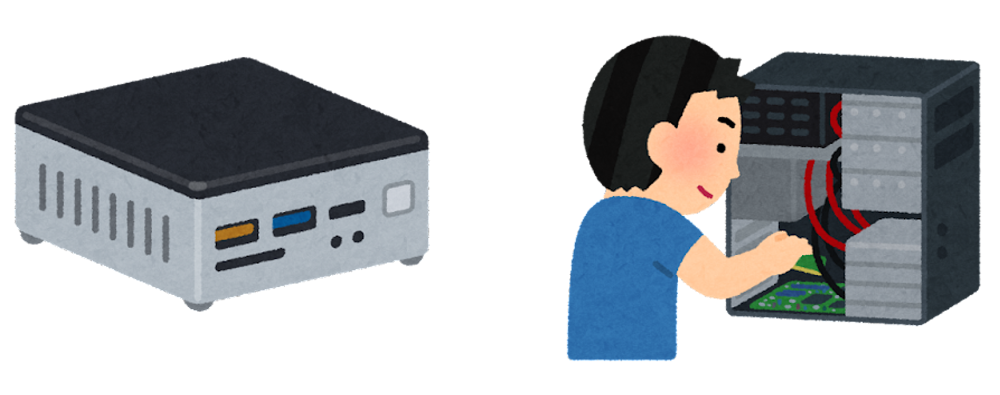
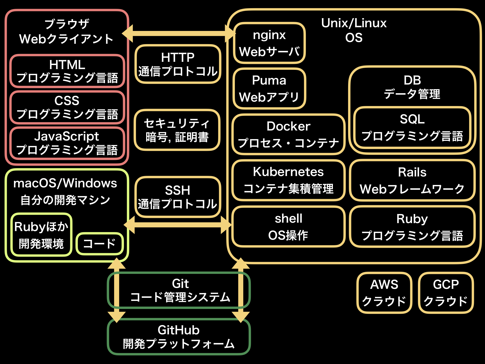
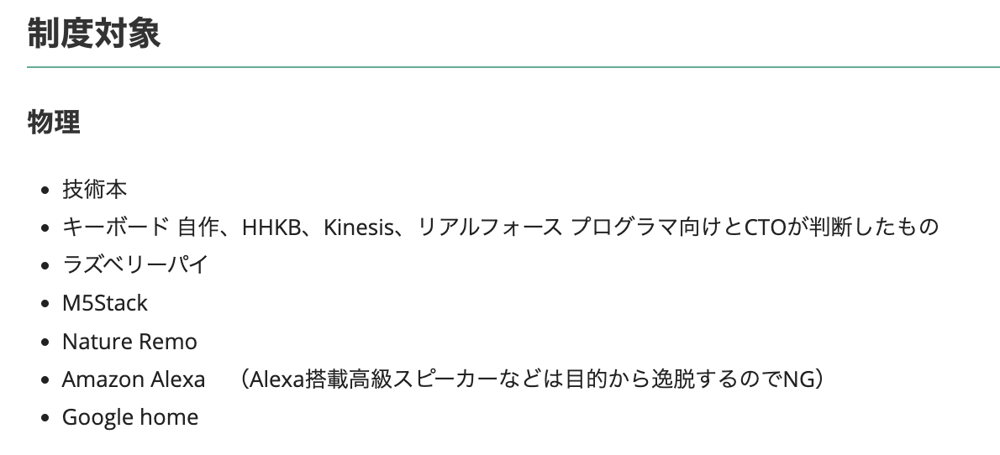
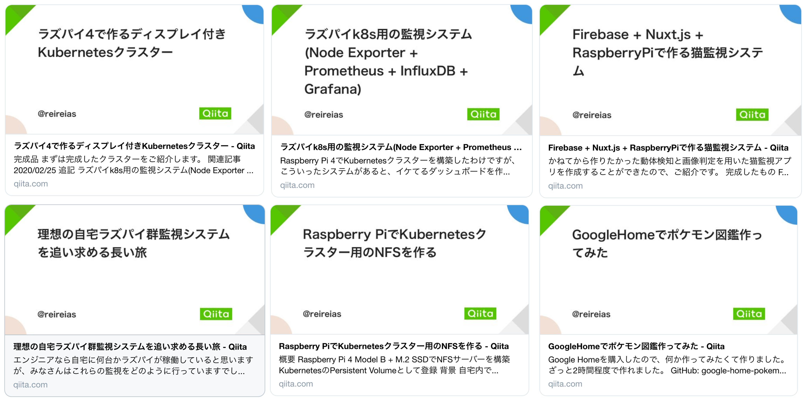
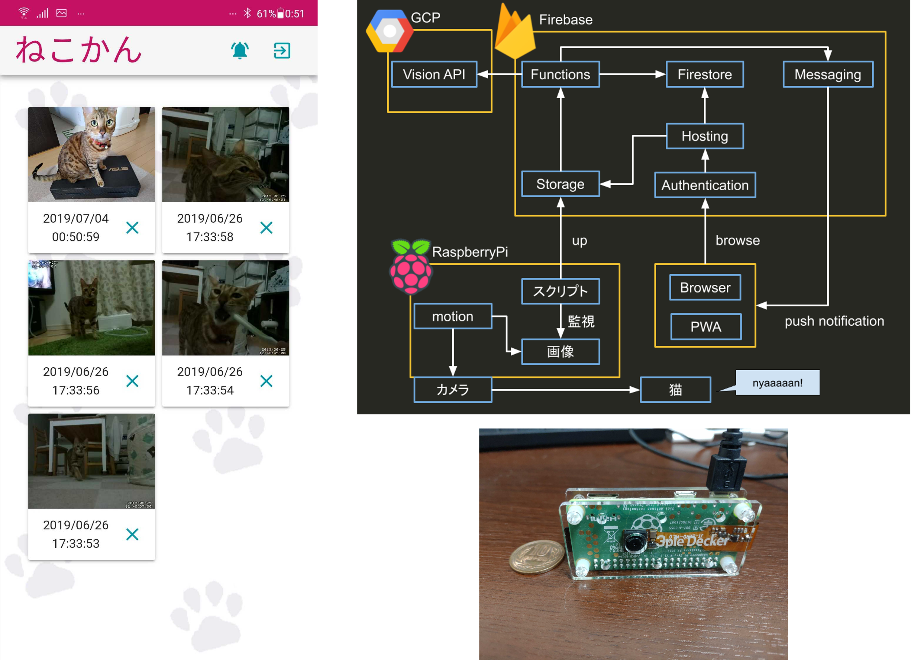
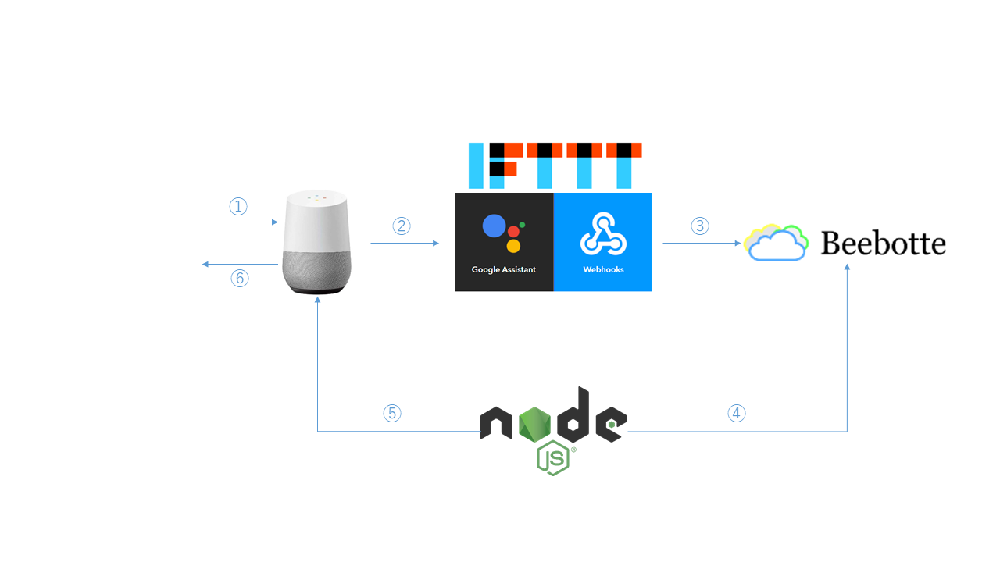

# 自宅サーバーはいいぞ

---

### 自己紹介

CTO室 SRE

特徴: MENSA会員

---

趣味: 猫、ゲーム

---

皆さん自宅にサーバーってありますか？

---

こんなのとか

出典: <a href="https://xtech.nikkei.com/atcl/nxt/news/18/05127/">https://xtech.nikkei.com/atcl/nxt/news/18/05127/</a>

---

こんなのとか

---

こんなのとか

出典: <a href="https://kenzo0107.github.io/2022/01/05/2022-01-06-raspberrypi-co2-monitoring/">Raspberry PI zero で CO2 濃度測定 & アラートを LINE 通知</a>

---

今日は自宅サーバーの魅力を語る！

---

## 1. 勉強になる

---

**現代のWebサービス開発者、必須スキル多すぎ問題**

---

出典: [RubyとRailsの学習ガイド2019年版](https://magazine.rubyist.net/articles/0059/0059-Ruby-Rails-Beginners-Guide.html)

---

Ruby, Rails, JavaScript 以外にも、

**Linux**, **Docker**, **AWS**, **Kubernetes**, **Git**, **TCP/IP** なんかも知らないと、

現代のWebサービス開発は難しい。

---

「サーバーレスなこの時代にLinuxの知識いらなくね？」

#### サーバーレスとは、サーバー管理から解放されること

**管理しなくていい ≠ 知らなくていい**

---

そんなもろもろを楽しく勉強できる環境があるらしい。

## そう、自宅サーバーならね

---

### 手を動かすのが一番ってみんな知ってる

- OSインストールや各種デーモンの設定

- Dockerやk8sのインストール作業

- CPUがarm(M1 Macもコレ)になると動かないコンテナ

- サーバー管理が登竜門とされていた時代もある(らしい)

---

### 身についた技術

- armアーキテクチャ用のDockerイメージビルド方法

- Kubernetesのノード構築とCDパイプラインの構築

- Prometheus

- Linuxのブートディスクの仕組み

- M.2 SSDの規格

- USBの規格

---

## 2. 実は安い

---

「なんかいろいろ買わないといけなさそうで高そう」

「電気代とかけっこうかかるんでしょう？」

↓

#### 実はRaspberry Piってお手頃なマシンがあるんですよ

---

- Mac Studio: `249,800円`

- Raspberry Pi 4(2GB): `6,413円`

- Raspberry Pi Pico: `505円`

#### Mac Studio買うお金で**39台**のラズパイを買える！
### Picoなら**495台**買える！！

※ 同スペック帯のAWS `t4g.small` は `約1700円/月`

---

電気代も`月60円`程度

(Raspberry Pi 4 の消費電力から計算)

---

さらに、ラズパイはテックサポート対象！

## つまり実質タダ！

---

## 3. アウトプットが楽しい

---

ラズパイ絡みで無限に記事が書ける！

---

Kubernetesクラスター。Nodeは3台。SSDを永続化ストレージとしてマウント。

---

動体検知 -> 猫判定 -> Push通知

---

「OK Google ポケモン図鑑 ピカチュウ」

「ピカチュウ ねずみポケモン はじめて(ry」

---

## さあ、今すぐラズパイをポチろう！
