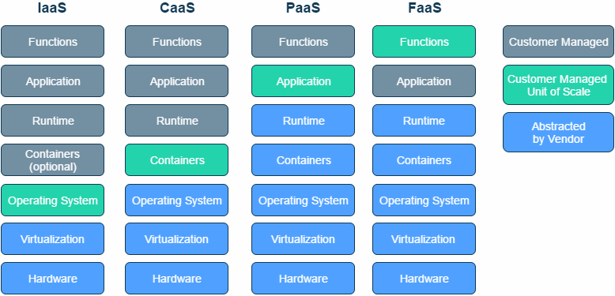
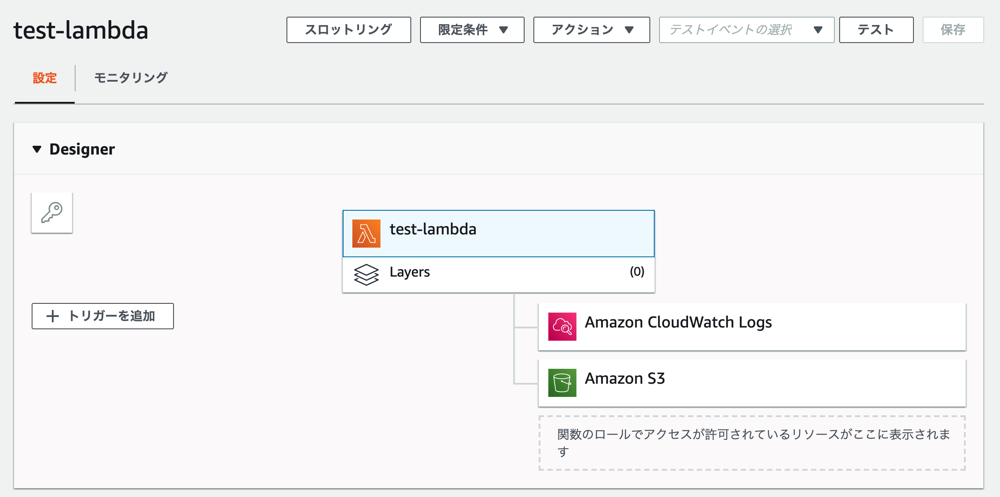
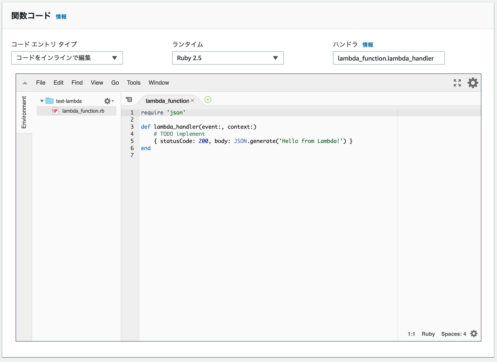
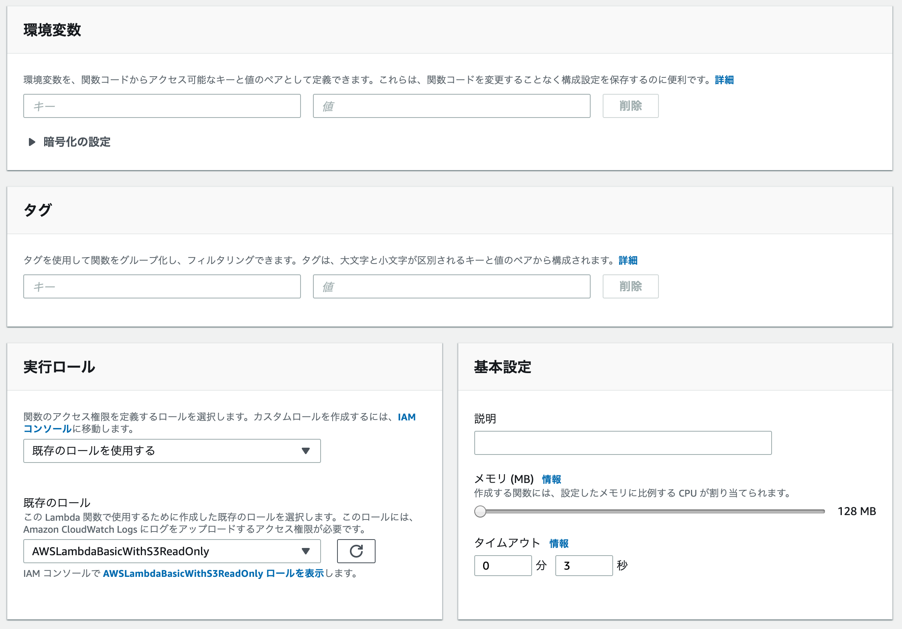
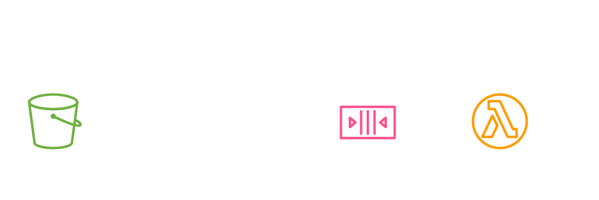
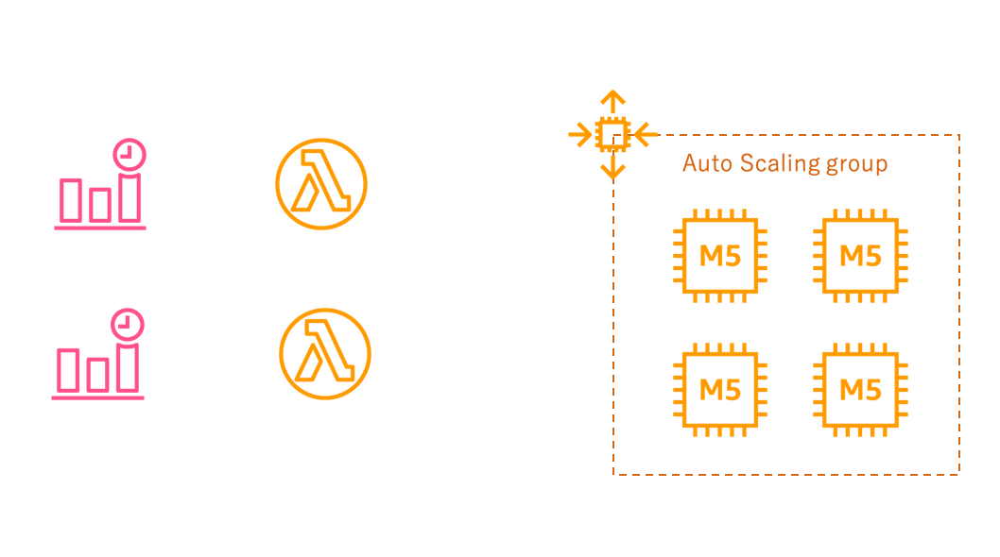
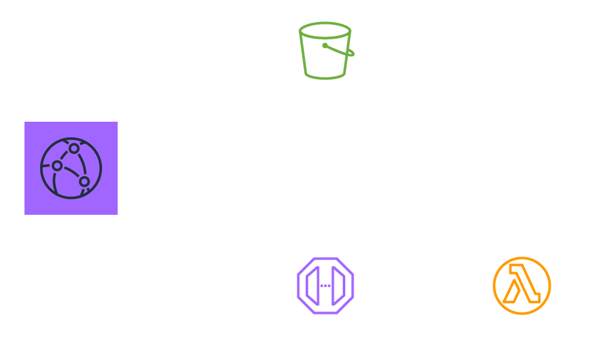
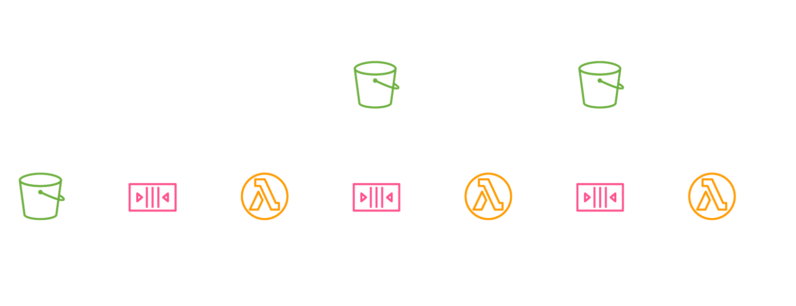
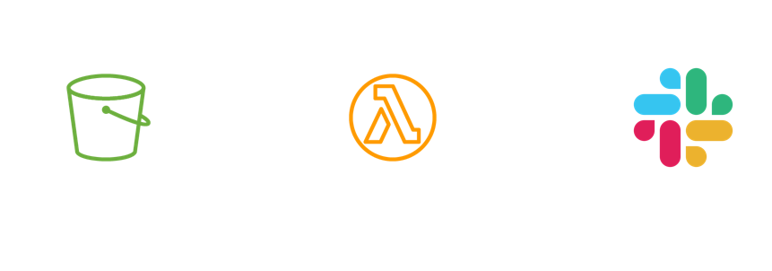
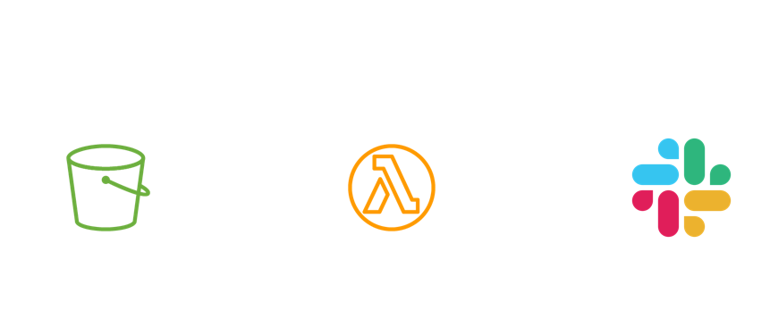

# インフラ勉強会 #5
# Lambda

---

## ゴール

- FaaSの特徴を知る

- FaaSの使い所、アーキテクチャ設計を知る

- AWS Lambdaで動くコードを書いてみる

---

# Lambdaを知る

---

## AWS Lambda

- AWSの一番メジャーな**FaaS**

-  FaaS = Function as a Service

- イベント発生時にコードを実行する

 

---

## Lambdaの特徴 その1
### サーバーレス

- 実行インスタンスの管理が不要

- 実行される関数だけ記述すればよい

- 管理コスト低(構築、OSアップデート、権限管理等)

---

## Lambdaの特徴 その2
### 高スケーラビリティ

- インスタンスよりも遥かにスケーリングが簡単

- デフォルトで1000まで同時実行可能

- スケーリング速度も高速
  - Lambda用の軽量なMicroVM上にホストされる

---

## Lambdaの特徴 その3
### 時間単位課金
- 処理時間に応じた課金

- CPU、メモリは考慮される

- 実行していない間は課金されず

- 課金は100ms単位

---

## Lambdaの注意点 その1
### コールドスタート問題

- Lambdaは実行時にデプロイパッケージの展開やランタイムの初期化などが走る

- 継続的にアクセス実行される場合は、上記のすでにロードされた環境が再利用される

- しばらく利用されないと、上記の環境が破棄され、**再実行時に時間がかかる**

---

詳細は[こちら](https://dev.classmethod.jp/cloud/aws/lambda-memory-alloc-and-coldstart/)

回避策もある

- 定期的に起動してダミーの処理を実行する

- 起動が早い言語を選ぶ(JVMは遅い)

**が、これらの対策を取らなければいけないような場合は本当にLambdaで実行すべきか再考したほうがいい**

---

## Lambdaの注意点 その2
### EC2のほうが安いケースがある

- **「それEC2でよくね？」**パターン

- 定常的に起動し、大きくスケーリングもしない場合はEC2でよい

- 例: メモリ2GB、1ヶ月の場合
  - Lambda: **$88**
  - EC2(t3.small): **$19**

- Lambdaをどうしても使いたい開発者が陥りがち

<!--
計算式

Lambda
2048MB $0.000003334/ms
1month: 0.000003334 * 10 * 60 * 60 * 24 * 30.5 = $88/month

EC2
t3.small(2GiB) $0.0272/h
1month: 0.0272 * 24 * 30.5 = $19/month
-->

---

## Lambdaの注意点 その3
### メモリ/実行時間/関数のサイズに制限がある

- メモリはMAX 3008MB

- **実行時間は900秒(15分)**

- パッケージサイズは50MBまで
  - 解凍後は250MBまで

**リトライ機能はあるが、実行時間を気にしなければいけないレベルの処理はLambdaに乗せるのはやめましょう**

---

## Lambdaの注意点 その4
### RDSと繋ぐな
- 有名なアンチパターン、**LambdaとRDSは相性が悪い**

- RDSへの同時接続数がネックになり、RDSのCPU、メモリを消費する

- こんな記事もある [LambdaとRDSで爆死してみる](https://qiita.com/asahi0301/items/49808ccf16dc2fff06f3)

- Lambdaから使いたいならDynamoDBを使いましょう

- どうしてもRDSにデータ入れたいなら、Lambda  → SQL → バッチ でやりましょう

---

## XaaSとの比較

出典: [https://serverless.zone](https://serverless.zone/abstracting-the-back-end-with-faas-e5e80e837362)

---

## XaaSに対応するサービス

| 名称 | AWS       | GCP             |
|------|-----------|-----------------|
| IaaS | EC2       | GCE             |
| CaaS | ECS, EKS  | GKE             |
| PaaS | Beanstalk | GAE             |
| FaaS | Lambda    | Cloud Functions |

---

## [ハンズオン] LambdaでSlack通知

- まずは簡単な例から

- 実行するとSlackにWebhookでメッセージを投稿する

- 通知先URLはLambdaの環境変数に設定

- 実行はコンソールから手動で行う

---

### Lambda関数の作成
- サービス > Lambda > 関数の作成

- 一から作成が選択されているはず

- 関数名: 任意(自分の名前を含めること)

- ランタイム: **好きな言語**

- アクセス権限: `既存のロールを使用する`

  - `AWSLambdaBasicWithS3ReadOnly` を選択

---

### 画面の説明

---

### 画面の説明

---

### 画面の説明

---

### 環境変数の設定

- Slackで配布したwebhook用のURLを `WEBHOOK_URL` という名前で環境変数に設定する

---

### 試しに実行する

- テストイベントの選択 > テストイベントの設定

- 適当なイベント名をつけて作成

- テストボタンを押す

- 結果はエディタの下や、画面上部で確認できる

---

### 実装する

- ヒント: ライブラリがほとんど無いので言語の標準ライブラリ内でjsonをPOSTする必要がある

---

# Lambdaを使ったアーキテクチャを知る

---

## 特徴(おさらい)
- サーバーレス
- 高スケーラビリティ
- 時間単位課金

- コールドスタート
- コストはEC2のほうが安いこともある
- VPC内リソースへアクセスしないほうがよい

---

## 何に向いているか？

- バーストするような処理

- webサーバーからの負荷分散

- イベントをトリガーにするケース

- 処理が非同期でよいケース

- サーバーを用意するのも面倒な(コストがかかる)ケース

---

#### 例1: S3にファイルが追加されたらサムネイル作成
`負荷分散` `イベント` `非同期`

- S3へのファイル追加のイベントをトリガーに処理実行
- SQSを間に挟むことで、監視やキューイングを強化
- webサーバーで画像処理を行うリソースをLambdaに逃がす

---

#### 例2: 夜間はEC2をスケールイン
`サーバー用意が面倒`

- CloudWatch Eventのスケジュール機能でcronのように起動できる
- 運用系のAWSのAPI操作をLambdaから実施できる

---

#### 例3: SSR on Lambda
`バースト` `負荷分散`

- Server Side RenderingをLambdaで実行
- 静的ファイルはS3、他はLambdaにルーティング
- EC2のwebサーバーよりもスケーラビリティに優れる

---

#### 例4: イベントドリブンアーキテクチャ
`負荷分散` `イベント` `非同期`

- Lambdaでの処理をキューでつないだアーキテクチャ

- 下の図は、PDFがS3にアップロードされたら、ページ毎にサムネイル画像を作成する例

---

## 向いていない例☠️

- RDSへ接続する

- 処理に時間がかかる

- 既存のソースコードから切り出しにくい

- リトライが走るとぶっこわれる

- 外部コマンドが必要

---

## [ハンズオン] S3にファイルが登録されたらSlack通知

- オブジェクトが登録されたら、そのオブジェクトのキーをSlackに通知する

---

### S3バケットの準備

- サービス > S3 からバケットを作成

- 名前: 任意(自分の名前を含めること)

- その他の設定はデフォルトでOK

---

### Lambdaの設定

- トリガーを追加からS3を選択

- バケットは先程自分で作成したバケットを選択

- その他の項目はデフォルト

---

### テストイベントの作成

- テストイベントの設定から新しく作成する

- イベントテンプレートから `Amazon S3 Put` を選択する

- バケット名の部分は自分で作成したバケット名と合わせておく

- objectのkeyも自分のものとわかるようにしておくとよい

---

### Lambda関数の実装

- ヒント: ハンドラーの引数のイベントの中身を確認してみる

---

## [ハンズオン] S3のファイル一覧をSlack通知

- オブジェクトが登録されたバケットの、オブジェクト一覧をSlackに通知する

---

### Lambda関数の実装

- ヒント: AWS SDKはどの言語でもデフォルトでLambda上から利用できる

- ヒント: オブジェクト一覧を取得できるメソッドがSDK内にある

---

## [ハンズオン] 回答例

- Ruby, Node.js, Pythonの回答例を記載

---

## まとめ

- Lambdaは便利

- 使い所やアーキテクチャ設計に気をつけましょう
