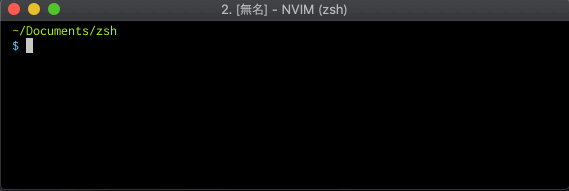
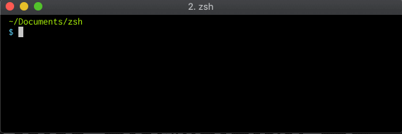
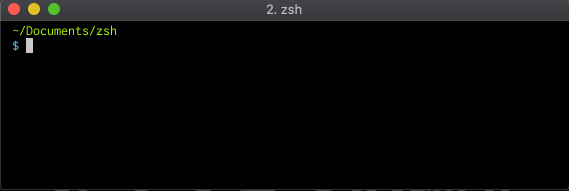
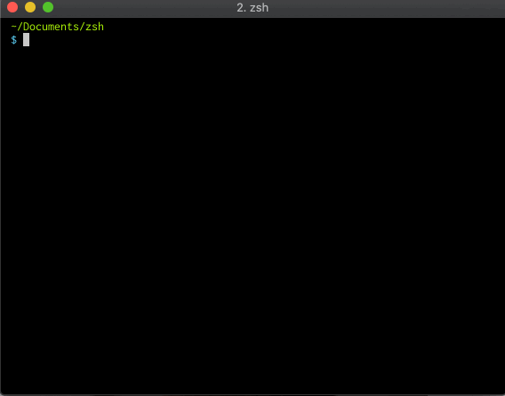
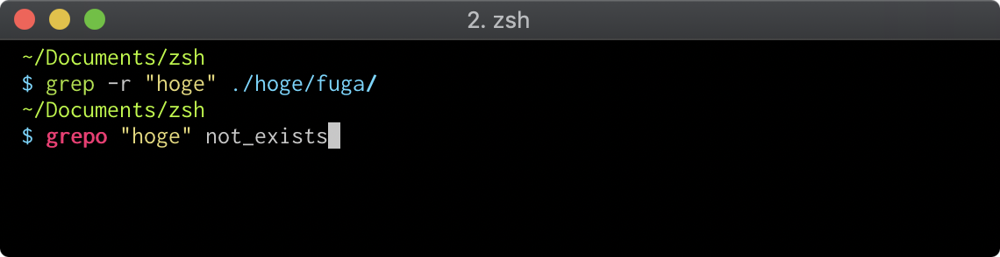
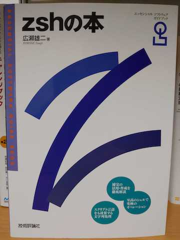

# zsh

---

## みなさんシェルは何使ってますか？

- bash

- zsh

- fish

- terminal使わない勢

---

### Q. なぜCUI(ターミナル)にこだわるのか
### A. CUI(ターミナル)の方がGUIより速いから

---

### 例: `work/app/jobs`以下のファイルをカレントディレクトリにコピーしてくる

---

### GUIの場合
- ディレクトリを移動して
- ファイルを全部マウスで選択して
- 右クリックしてコピーして
- ディレクトリを移動して
- 右クリックで貼り付け！

---

### CUIの場合
**`cp work/app/jobs/* ./`**

Tabによる補完も使えば数タイプで終わる!!!

---

## なぜCUIだと作業が速いのか？

---

## だってマウスよりキーボードの方がボタン多いじゃん!!!

---

#### Q. なぜシェルにこだわるのか
#### A. シェルとは一生の付き合いになる可能性が非常に高い
- 言語やエディタは興亡が激しい

- シェルはそこまでではない

- どんな開発を行うときでも使う = 効率化の恩恵がでかい！

- シェルによる開発の効率化は**人生の効率化と言っても過言ではない**(過言)

---

## ということで、zshの紹介です

---

## zshとは？
- 読み方: ずぃーしぇる、ぜっとしぇる、ぜっしゅ
- bashの進化系でfishの機能も一部取り込んでいる
- 最後のシェルという意味で z が使われた

---

## Macではzshが標準に!!!

- macOS 10.15 Catalina からはzshがデフォルトになるようです

- shellにこだわりがない人も慣れておいて損はないのでは？

---

## zshのイイところ
- 補完が強力

- プラグインが便利

---

## タブ連打で候補を切り替え



---

## あいまい補完的なやつ



---

## オプションの補完



---

## サブコマンドの補完



---

### プラグイン「zsh-syntax-highlighting」



---

## さっきの引数(単語指示子)

- **!^**で前回のコマンドの最初の引数
- **!$**で最後の引数
- **!:n**でn番目の引数

```sh
# なんか深いディレクトリを作った
mkdir -p hoge/fuga/foo/bar/nyan

# さっき作ったディレクトリへ移動
cd !$
```

---

### zshは本当に高機能です
### 気になる人は[この本](https://www.amazon.co.jp/zsh%E3%81%AE%E6%9C%AC-%E3%82%A8%E3%83%83%E3%82%BB%E3%83%B3%E3%82%B7%E3%83%A3%E3%83%AB%E3%82%BD%E3%83%95%E3%83%88%E3%82%A6%E3%82%A7%E3%82%A2%E3%82%AC%E3%82%A4%E3%83%89%E3%83%96%E3%83%83%E3%82%AF-%E5%BA%83%E7%80%AC-%E9%9B%84%E4%BA%8C/dp/4774138649)を読んでみるといいかも



---

# zshを使って快適なCUIライフを！

---

## おまけ
`.zshrc`等を以下のリポジトリで公開してます。

<a href="https://github.com/reireias/dotfiles"></a>

.zshrcに関しては、以下の記事で解説してます。

[.zshrcを晒す - Qiita](https://qiita.com/reireias/items/60ee9934fb1f5d94f125)

---

## dotfiles輪読会とかやったら楽しそう

(ただし、人が集まれば)
